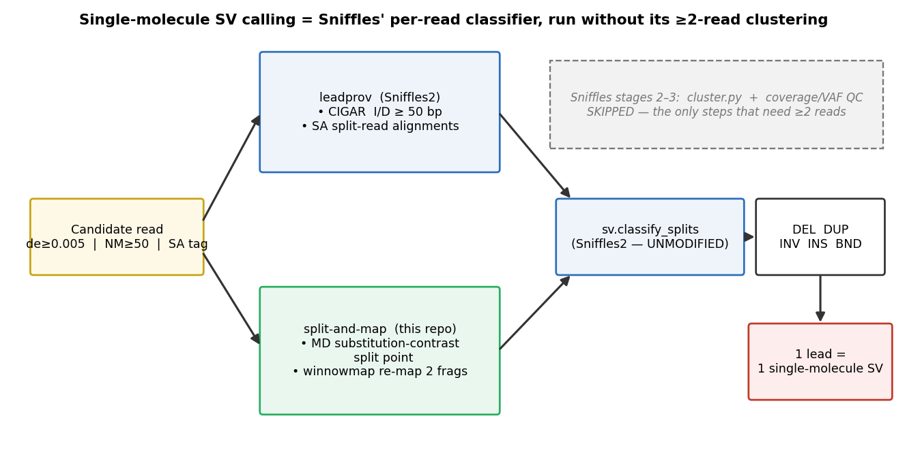
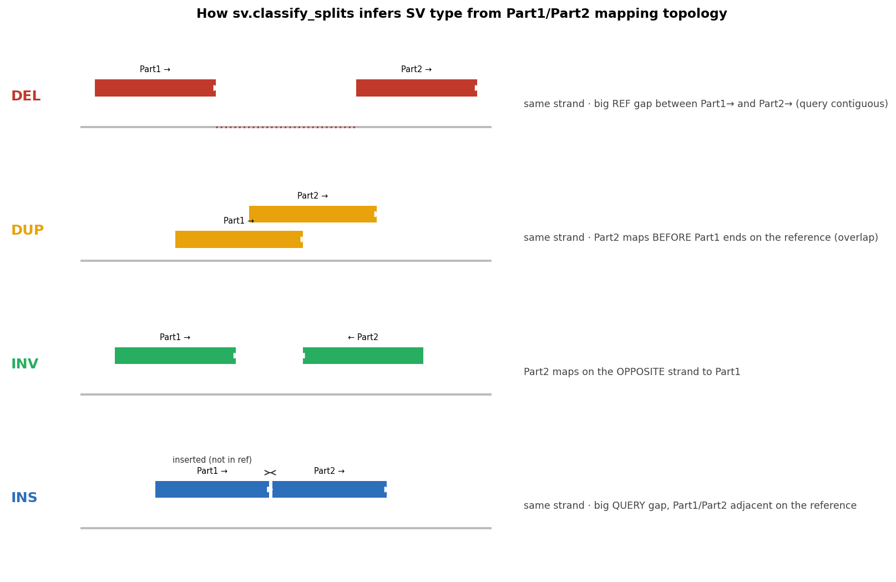

# How single-molecule SV calling works — and how Sniffles2 is adapted to 1× support

This document explains, step by step, how every number in this pipeline is computed, and
in particular **how Sniffles2's algorithm is used to call structural variants supported by
a single read (1× "coverage")** — something stock Sniffles2 will not do.

> **Important, in plain terms:** we do **not** fork or modify Sniffles' source code. We
> `import` Sniffles2's own per-read signal extractor and topology classifier and call them
> directly, while **skipping the part of Sniffles that requires ≥2 reads**. Sniffles is
> pinned as a dependency (`sniffles==2.7.5`); the single-molecule behaviour lives entirely
> in the thin wrappers in `scripts/` of this repo.

---

## Diagrams

**How a read becomes a single-molecule SV call** (and which Sniffles stages are skipped):



**How `sv.classify_splits` infers the SV type from the Part1/Part2 mapping topology** — the
read is split into two fragments (by a clean `SA` split, or by our split-and-map), and the SV
type follows from their strand and reference/query coordinates:



---

## 1. Why stock Sniffles2 "needs coverage", and which part actually does

Sniffles2 runs in three stages:

| stage | module (sniffles 2.7.5) | per read? | needs ≥2 reads? |
|-------|--------------------------|-----------|------------------|
| **1. signal extraction** ("leads") | `leadprov.py` | **yes — fully per-read** | no |
| 2. clustering | `cluster.py` | no (groups reads) | **yes** |
| 3. genotyping / QC filters | `sv.py`, `postprocessing.py` | no | **yes** (support, VAF, coverage) |

The SV-detection intelligence — reading a CIGAR string for `I`/`D` operations and reading
split-read (supplementary, `SA`-tag) topology to decide DEL/DUP/INV/INS/BND — is **stage 1,
and it is inherently single-read**. The "you need coverage" requirement comes only from
stages 2–3 (a lead must be corroborated by other reads to survive). 

**So to call SVs at 1×, we keep stage 1 and drop stages 2–3.** Every lead becomes one
single-molecule SV call.

We verified this empirically: stock Sniffles2 forced to `--minsupport 1 --mosaic
--mosaic-af-min 0` still emits only **3–6 calls per sample** in these centromeres, because
its clustering/QC discards isolated single-read signals. The per-read approach here recovers
thousands. (Script `04_sniffles_stock.sh` runs that control.)

## 2. The exact Sniffles function we reuse

The topology classifier is used **unmodified**:

```python
from sniffles import sv
all_leads = sv.classify_splits(read, leads, config, contig)
```

`sv.classify_splits` (sniffles 2.7.5, `sniffles/sv.py`) takes a read's primary + supplementary
alignments as `Lead` objects (sorted by query position) and returns the SV type from strand +
reference/query coordinate topology:

- same strand, query gap ≫ ref gap → **INS**
- same strand, ref gap ≫ query gap → **DEL**
- same strand, second fragment starts before the first ends on the reference → **DUP**
- opposite strand → **INV**
- different contig → **BND**

The CIGAR-indel leads (`I`/`D` ≥ 50 bp) mirror Sniffles' `leadprov.read_iterindels` loop;
the split-read lead construction mirrors `leadprov.read_itersplits`. Both are ~10 lines and
live in `scripts/02_leadprov_sm.py`. A self-test (`python scripts/02_leadprov_sm.py
--selftest`) asserts `classify_splits` returns DEL/DUP/INV on hand-built topologies, proving
we drive the real Sniffles function correctly.

The only config Sniffles needs for this function is four numbers (`minsvlen_screen=50`,
`long_ins_length=2500`, `bnd_min_split_length=1000`, `dev_seq_cache_maxlen=0`) — supplied as a
`SimpleNamespace`, mirroring Sniffles' own defaults but with the 50 bp screen the colleague's
method uses.

## 3. Two complementary single-molecule detectors (both end in `classify_splits`)

**(a) leadprov** — `02_leadprov_sm.py`. For each candidate read: emit CIGAR `I`/`D` ≥ 50 bp
(INLINE leads) and feed primary+`SA` alignments to `sv.classify_splits` (SPLIT leads). This is
Sniffles' own logic, per read, no clustering.

**(b) split-and-map** — `03_split_and_map.py` (a colleague's idea). Some reads map as one
linear alignment whose second half is a run of mismatches (a satellite event aligned *out of
phase*, so it never produced a clean split). We find the breakpoint as the read position of
**maximal left/right substitution-rate contrast** (from the `MD` tag), cut the read there,
re-map both halves independently with `winnowmap`, and call an SV when both fragments are ≥ 1 kb,
MAPQ ≥ 10, and the reference gap ≥ 50 bp. Topology is decided by the **same**
`sv.classify_splits` run on the two remapped fragments — so both detectors share one classifier.

Detectors are unioned and de-duplicated per read in `05_merge_classify.py`.

## 4. Candidate read selection (the input gate)

`01_candidates.py`. A read's primary alignment is a candidate if
`de ≥ 0.005` **OR** `NM ≥ 50` **OR** it has an `SA` tag — i.e. it is divergent or split.
`de` = gap-compressed per-base divergence (minimap2/winnowmap tag); `NM` = edit distance;
`SA` = has supplementary alignments. Reads are restricted to those anchored in the centromere.

## 5. How each downstream number is computed

| quantity | script | definition |
|----------|--------|------------|
| **read-Mb normalization** | `07_normalize.py` | rate = calls / (Mb of aligned read sequence overlapping the CEN). Removes depth — single-molecule, so depth divides out exactly. |
| **read-quality controls** | `08_read_qc.py` | arm `de`% (≈ sequencing error), CEN `de`%, `np` (HiFi passes) and `rq` (predicted accuracy) from the source `hifi_reads.bam` (these tags are stripped by `samtools fastq`, so read them pre-mapping). |
| **CEN178 orientation** | `10_cen178_orient.py` | minimap2 of the 178-bp CEN178 consensus vs each CEN reference; majority strand per 1 kb bin → forward(+)/reverse(−) array blocks. |
| **recurrence / "VAF"** | `11_recurrence.py` | for a recurrent locus, VAF = supporting reads / spanning coverage. High VAF + whole-monomer size = **fixed difference vs the reference assembly**, not a somatic hotspot. (We deliberately do **not** call this a Sniffles VAF.) |
| **read-support distribution** | `12_support_distribution.py` | per-locus count of supporting reads (1×, 2×, …). `support = 1` = exclusively single-molecule. Shown all-reads and **read-budget-matched** (leaf downsampled to pollen's read count, so the support tail is comparable). |
| **singleton annotation** | `13_annotate_singletons.py` | each 1× event tagged with detector(s), read `de`, MAPQ, and **TRASH run on the read window** → `n_monomers`, mean monomer width, `cen178` confirmed, and `in_register` (whole-CEN178-monomer event in a confirmed CEN178 array = unequal-sister-chromatid-HR signature). Confidence = HIGH/MEDIUM/LOW from the combination. |

## 6. What "1× coverage" does and does not buy you

- **Buys:** sensitivity to events carried by a single molecule (somatic mosaicism, meiotic
  recombination products in pollen), which clustered callers discard.
- **Does not buy:** the ability to distinguish a true somatic single molecule from a one-off
  mapping/sequencing artifact **by support alone**. That is why step 13 adds orthogonal
  evidence (multi-detector agreement, read quality, and the 178-bp register check), and why
  high-support recurrent loci are flagged as fixed-vs-reference (step 11) rather than hotspots.

## 7. Attribution

Sniffles2 (Smolka, Romanek et al.) is used as an unmodified dependency: <https://github.com/fritzsedlazeck/Sniffles>, MIT-licensed, v2.7.5.
This repository contains only the single-molecule wrappers, normalization, controls and figures;
it does not redistribute Sniffles source.
